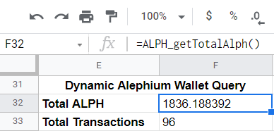
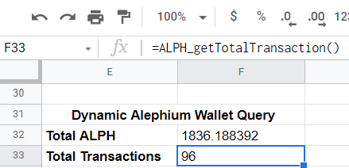
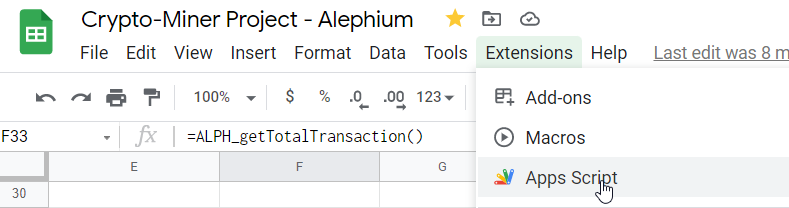
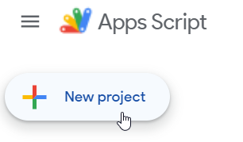
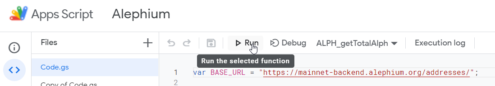

# Alephium-GoogleAppScripts
Fun script to use with Google Sheet to query funny and interesting things on Alephium crypto project.
This repository contains basic Google AppScripts that can be used in your GoogleSheet. All these scripts are related to Alephium project. Below you can find basic explaination about how to use these scripts

### Constant variables
To use these functions, two variables are set.
> - BASE_URL : fixed to "https://mainnet-backend.alephium.org/addresses/"
> - ALPH_UNIT : fixed to 10^18
> - wallet_address : add your Alephium's wallet address here

If you don't want details, jump to <a href="https://github.com/MrGoldenpioche/Alephium-GoogleAppScripts#how-to-use-them">How to use this ?</a>

## Available functions

### ALPH_makeHttpRequest()
This core function make HTTP Get request to mainet backend of Alephium against a specific address to retrieve all information about this wallet address

### ALPH_getTotalAlph()
This function first call **ALPH_makeHttpRequest()** and return the total number of ALPH tokens for the specified wallet.

### ALPH_getTotalAlph2(wallet array)
Not available for the moment.
Must be implemented.

### ALPH_getTotalTransaction()
This function first call **ALPH_makeHttpRequest()** and return the total number of transaction for the specified wallet.

### ALPH_getCurrentTokenPrice()
Not available for the moment. 
Waiting on listing on Exchange.

### ALPH_getTotalCirculatingSupply()
Not available for the moment. 
Must be implemented.

## How to use ?
Go to https://script.google.com/ and create a new project named **Alephium**. 
This will automatically create a file named **code.gs**. Open it and past the functions you want in it.
Once done, you can simply save your project and run the code to be sure that all data are retrieved correctly 
If all is working as expected, you can call these functions into GoogleSheet :-)

### Step 1 - Open AppScript from GoogleSheet

### Step 2 - Create new project

### Step 3 - Past code and test it
Don't forget to update the variable **wallet_address** and then run the desired function. 

### Step 4 - Save project and call functions into GoogleSheet
Look examples above. 

## References
> - <a href="https://mainnet-backend.alephium.org/docs/index.html?url=/docs/explorer-backend-openapi.json">Mainnet Backend API</a>

